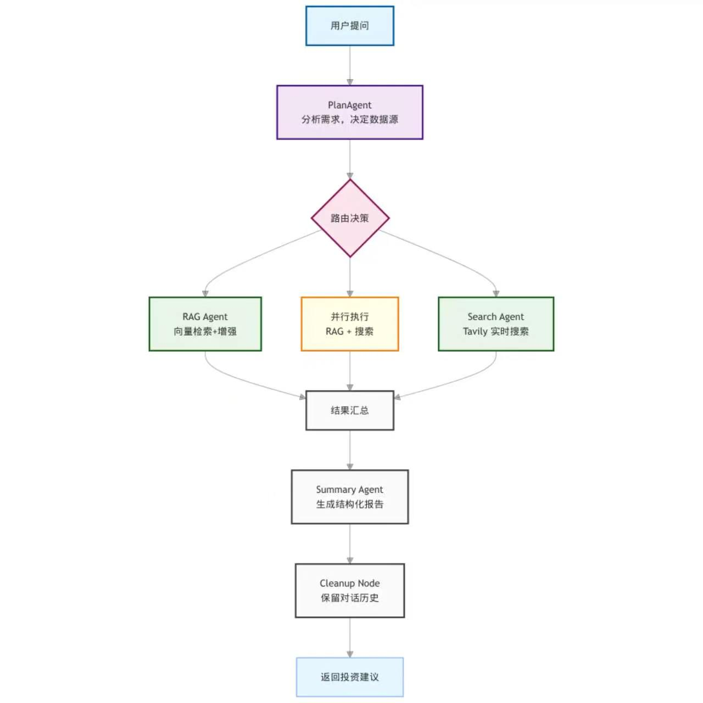

# 股票分析助手

基于 LangGraph 的智能股票分析系统，支持知识库检索、实时搜索和多轮对话。

## 功能特点

- 🤖 **智能分析**：PlanAgent 自动分析用户需求，决定最佳分析策略
- 📚 **知识库检索**：基于 FAISS 的向量检索，支持历史财报、投资理论查询
- 🔍 **实时搜索**：Tavily 搜索 API 获取最新股价、新闻动态
- ⚡ **并行执行**：RAG 和搜索可并行执行，提高响应速度
- 💬 **多轮对话**：自动保留对话历史，支持上下文理解
- 🎯 **专业报告**：SummaryAgent 生成结构化投资建议

## 快速开始

### 1. 安装依赖

```bash
pip install -r requirements.txt
```

### 2. 配置环境变量

复制 `.env.example` 为 `.env`，填写你的 API 密钥：

```bash
cp .env.example .env
```

编辑 `.env` 文件：

```env
# DeepSeek API（或其他 OpenAI 兼容 API）
API_KEY="your-api-key"
BASE_URL="your-base-url"
MODEL="your-modelname"

# Tavily API（用于实时搜索）
TAVILY_API_KEY="your-tavily-key"
```

### 3. 运行程序

```bash
python main.py
```

## 使用示例

```
============================================================
  股票分析助手已启动！
  支持多轮对话，助手会记住上下文
------------------------------------------------------------
  命令:
    exit / quit / 退出  - 结束对话
============================================================

[1] 您: 贵州茅台怎么样？
助手: 正在分析...
----------------------------------------

📚 【知识库分析】
贵州茅台是中国白酒行业龙头企业...

🔍 【实时信息】
贵州茅台(600519)今日股价...

💡 【最终建议】
基于基本面分析和技术面分析，建议...

[2] 您: 那它的财报数据呢？
助手: 正在分析...
----------------------------------------
💡 【最终建议】
根据您之前询问的贵州茅台，2023年财报显示...
```

## 项目结构

```
.
├── main.py                      # 主程序入口
├── model_cache/                 # 模型缓存目录（Embedding 模型）
├── core/                        # 核心模块
│   ├── graph.py                 # LangGraph 工作流构建
│   ├── router.py                # 路由决策（支持并行）
│   ├── nodes.py                 # 节点工厂
│   ├── state.py                 # 状态定义
│   └── __init__.py
├── agents/                      # 智能体
│   ├── plan_agent.py            # 计划 Agent（分析需求）
│   ├── rag_agent.py             # RAG Agent（知识库检索）
│   ├── search_agent.py          # 搜索 Agent（实时信息）
│   ├── summary_agent.py         # 总结 Agent（生成报告）
│   └── base_agent.py            # 基础 Agent 类
├── rag/                         # RAG 模块
│   ├── knowledge_base.py        # 知识库管理
│   ├── vector_store.py          # FAISS 向量存储
│   ├── rag_retriever.py         # RAG 检索器
│   ├── document_processor.py    # 文档处理
│   └── extract.py               # 文档加载
├── configs/                     # 配置
│   ├── model_config.py          # 模型配置（LLM + Embedding）
│   └── data_schema.py           # 数据模型
├── tools/                       # 工具
│   └── web_search.py            # Tavily 搜索
├── vector_stores/               # 向量库存储
│   └── default_kb/              # 默认知识库
└── requirements.txt             # 依赖列表
```

## 工作流程



### 流程说明

| 步骤 | 节点 | 说明 |
|:---:|:---|:---|
| 1 | **PlanAgent** | 理解用户意图，规划分析策略 |
| 2 | **路由决策** | 智能判断需要哪些数据源 |
| 3 | **RAG Agent** | 从本地知识库检索相关文档 |
| 4 | **Search Agent** | 调用 Tavily API 获取实时信息 |
| 5 | **并行执行** | RAG 和搜索可同时运行，提高效率 |
| 6 | **Summary Agent** | 整合结果，生成专业投资建议 |
| 7 | **Cleanup Node** | 保存对话历史，支持多轮交互 |

## 配置说明

### 知识库

默认知识库位于 `vector_stores/default_kb/`，包含 2052 个文档片段。

> **版权说明**：本项目使用《股市操练大全》系列书籍作为知识库源文件。由于版权问题，PDF 文件不包含在仓库中，请自行准备。

如需添加新文档：

```python
from configs.model_config import EmbeddingModel
from rag.knowledge_base import KnowledgeBaseManager

# 初始化
embedding_model = EmbeddingModel()
kb_manager = KnowledgeBaseManager(embedding_model)
kb_manager.init_knowledge_base("您的知识库名称", vector_store_dir="vector_stores")

# 添加文档
kb_manager.add_document("path/to/document.pdf")
kb_manager.save("vector_stores")
```

### Temperature 设置

各 Agent 的 temperature 与其功能匹配：

| Agent | Temperature | 说明 |
|-------|-------------|------|
| PlanAgent | 0.5 | 计划需要一定灵活性 |
| RAGAgent | 0.3 | 分析要准确 |
| SearchAgent | 0.3 | 总结要客观 |
| SummaryAgent | 0.5 | 报告要平衡 |

### 多轮对话

系统自动保留最近 10 轮对话历史，支持上下文理解：

```
[1] 您: 分析一下茅台
[2] 您: 那它现在适合买入吗？      ← 理解"它"指茅台
[3] 您: 目标价多少？              ← 理解仍在讨论茅台
```

## 注意事项

1. **API 密钥**：确保 `.env` 文件中的 API 密钥有效
2. **网络连接**：首次运行需要下载 Embedding 模型（使用 hf-mirror 镜像）
3. **知识库**：如需更新知识库，请重新运行文档处理流程
4. **搜索功能**：需要 Tavily API Key，否则搜索功能不可用

## 技术栈

### 核心框架
- **框架**：LangGraph（工作流编排）
- **LLM**：DeepSeek / OpenAI 兼容 API
- **Embedding**：BAAI/bge-small-zh-v1.5（中文向量嵌入模型）

### RAG & 检索增强
- **向量数据库**：FAISS（Facebook AI Similarity Search）
- **文档处理**：PyPDF2 / pdfplumber（PDF解析）、RecursiveCharacterTextSplitter（文本分块）
- **向量检索**：余弦相似度检索 + Top-K 召回
- **知识库**：本地向量化知识库（支持增量更新）
- **检索策略**：多路召回（向量检索 + 实时搜索融合）

### 增强检索技术
- **查询重写（Query Rewriting）**：PlanAgent 自动分析用户意图，优化检索 query
- **混合检索（Hybrid Retrieval）**：知识库 RAG + Tavily 实时搜索并行执行
- **重排序（Reranking）**：基于相关性分数对多源结果进行排序融合
- **上下文压缩（Context Compression）**：智能筛选相关文档片段，避免上下文溢出

### 工具与 API
- **实时搜索**：Tavily Search API（高质量网络搜索）
- **天气数据**：高德天气 API（国内稳定）
- **网络请求**：requests、urllib3

### 开发环境
- **Python**：3.9+
- **依赖管理**：pip + requirements.txt
- **环境配置**：python-dotenv
