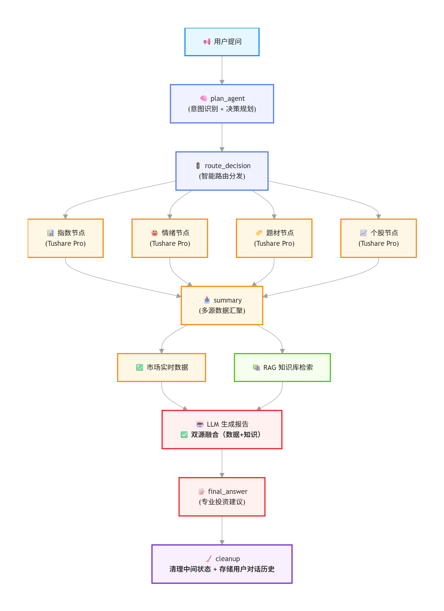

# 📈 股票分析助手

基于 LLM + LangGraph 的智能股票分析系统，支持多轮对话，提供专业投资建议。

## ✨ 功能特点

- **🧠 智能意图识别** - 自动识别用户意图（实时行情、投资分析、历史数据等）
- **📊 多数据源融合** - 整合大盘指数、个股数据、市场情绪、题材板块
- **💬 多轮对话支持** - 记住上下文，支持连续提问
- **⚡ 缓存机制** - 数据缓存 5-60 分钟，提升响应速度
- **🔍 知识库检索** - 基于向量检索的投资理论知识

## 🏗️ 系统架构



### 工作流程说明

1. **PlanAgent** - 分析用户意图，决定需要哪些数据源
2. **并行采集** - 同时获取大盘指数、市场情绪、题材板块、个股数据
3. **SummaryAgent** ⭐ - **项目亮点**：不仅汇总市场数据，还主动查询知识库，结合投资理论生成专业报告
4. **输出** - 生成包含数据支撑和理论依据的投资建议

> 💡 **核心设计**：Summary 节点采用"双源融合"——实时市场数据 + 知识库投资理论，提供更专业的分析

## 📋 数据源

| 数据源 | 说明 | 缓存时间 |
|--------|------|----------|
| 大盘指数 | 上证指数、深证成指、创业板指、沪深300、科创50 | 5分钟 |
| 市场情绪 | 涨跌停家数统计 | 5分钟 |
| 题材板块 | 热点板块排名 | 5分钟 |
| 个股数据 | 实时行情、历史K线、财务数据 | 5-60分钟 |

> 💡 数据来源：[Tushare Pro](https://tushare.pro/register) - 稳定可靠，不反爬

## 🚀 快速开始

### 1. 克隆项目

```bash
git clone https://github.com/yourusername/stock-analyzer.git
cd stock-analyzer
```

### 2. 安装依赖

```bash
pip install -r requirements.txt
```

### 3. 配置环境变量

```bash
cp .env.example .env
```

编辑 `.env` 文件，填入你的 API 密钥：

```env
# LLM API 配置（必填）
# 支持 DeepSeek、OpenAI、Kimi 等
API_KEY=your-api-key-here
BASE_URL=https://api.deepseek.com/v1
MODEL=deepseek-chat

# Tushare Pro Token（必填）
# 注册地址：https://tushare.pro/register
TUSHARE_TOKEN=your-tushare-token-here
```

### 4. 运行程序

```bash
python main.py
```

## 💡 使用示例

```
============================================
  股票分析助手已启动！
  支持多轮对话，助手会记住上下文
--------------------------------------------
  命令:
    exit / quit / 退出  - 结束对话
============================================

[1] 您: 分析一下贵州茅台

[1/3] PlanAgent: 正在分析意图和制定计划...
    [PlanAgent] 意图识别: investment_analysis, 数据源: ['index', 'sentiment', 'theme', 'stock']
----------------------------------------
    [IndexAgent] 正在获取大盘指数数据（Tushare）...
    [IndexAgent] 获取成功，指数数量: 5
    [SentimentAgent] 正在获取市场情绪数据（Tushare）...
    [SentimentAgent] 获取成功，涨停: 45, 跌停: 12
    [ThemeAgent] 正在获取题材板块数据（Tushare）...
    [ThemeAgent] 获取成功，板块数: 10
    [StockAgent] 正在获取个股数据（Tushare）...
    [StockAgent] 获取成功: 贵州茅台

[2/3] 数据获取完成，正在生成报告...
    已获取数据: 大盘指数, 市场情绪, 题材板块, 个股数据

[3/3] SummaryAgent: 生成最终建议...
========================================

## 投资建议 - 贵州茅台(600519)

### 1. 大盘环境
...（省略具体内容）...

### 2. 个股分析
...（省略具体内容）...

### 3. 操作建议
...（省略具体内容）...

---
⚠️ **风险提示**: 以上分析仅供参考，不构成投资建议。股市有风险，投资需谨慎。
```

## 🔧 配置说明

### Tushare Pro 积分说明

- **新用户**: 注册送 200 积分
- **免费额度**: 每分钟 120 次调用，足够个人使用
- **获取更多积分**: 完善资料、邀请好友、社区贡献

### 支持的 LLM 模型

| 服务商 | BASE_URL | 说明 |
|--------|----------|------|
| DeepSeek | `https://api.deepseek.com/v1` | 推荐，价格便宜 |
| OpenAI | `https://api.openai.com/v1` | 官方 API |
| Kimi | `https://api.moonshot.cn/v1` | 国内可用 |

## 📚 知识库

系统内置了 **20+ 本经典投资书籍** 的向量知识库，SummaryAgent 会根据用户问题智能检索相关理论支撑。

### 知识库书籍清单

| 书名 | 作者 | 内容简介 |
|------|------|----------|
| **股市操练大全（第1-10册）** | 黎航 | 中国股市投资经典教材，系统讲解K线、形态、技术指标等实战技巧 |
| **股市操练大全实战指导（1-2）** | 黎航 | 针对股市操练大全的实战案例解析与习题解答 |
| **聪明的投资者** | [美] 本杰明·格雷厄姆 | 价值投资圣经，巴菲特导师传世之作，阐述安全边际与市场先生概念 |
| **股票作手回忆录** | [美] 埃德温·勒菲弗 | 投机之王利弗莫尔传记，揭秘交易心理与市场操纵的经典之作 |
| **海龟交易法则** | [美] 柯蒂斯·费思 | 丹尼斯海龟实验全记录，系统化交易与仓位管理的实战指南 |
| **以交易为生** | [美] 亚历山大·埃尔德 | 交易心理分析经典，讲解三重滤网交易系统与心态控制 |
| **金融炼金术** | [美] 乔治·索罗斯 | 索罗斯反身性理论阐述，揭示市场参与者与价格的相互影响 |
| **原则** | [美] 瑞·达利欧 | 桥水创始人人生与工作原则，适用于投资和决策的理性框架 |
| **债务危机** | [美] 瑞·达利欧 | 桥水44年危机研究，债务危机模型与历史案例深度剖析 |
| **周期** | [美] 霍华德·马克斯 | 橡树资本创始人讲透市场周期，如何把握投资时机 |
| **指数基金投资从入门到精通** | 罗国庆 | 国内指数基金投资指南，ETF选择与定投策略实操手册 |
| **期货大作手风云录** | 肖遥（刘强） | 国内期货交易员真实经历，揭示杠杆交易的魅力与风险 |
| **交易心理分析** | [美] 马克·道格拉斯 | 深度剖析交易者心理陷阱，建立赢家心态的经典著作 |

### 知识库作用

在生成投资建议时，系统会**主动检索**知识库中与当前市场情况相关的投资理论，例如：
- 分析市场恐慌时 → 引用《聪明的投资者》中「市场先生」与「安全边际」概念
- 讨论趋势转折时 → 引用《海龟交易法则》中的突破系统与仓位管理
- 解读债务危机时 → 引用达利欧的债务周期模型

> 📖 **添加书籍**：将 PDF 放入 `docs/` 文件夹，运行 `python rag/load_kb.py` 自动导入

## 📁 项目结构

```
股票分析助手/
├── agents/                 # Agent 模块
│   ├── plan_agent/        # 计划制定 + 意图识别
│   ├── summary_agent.py   # 综合分析报告
│   └── base_agent.py      # Agent 基类
├── data_sources/          # 数据源模块
│   ├── index.py          # 大盘指数
│   ├── stock.py          # 个股数据
│   ├── sentiment.py      # 市场情绪
│   └── theme.py          # 题材板块
├── core/                  # 核心模块
│   ├── graph.py          # LangGraph 工作流
│   ├── router.py         # 路由决策
│   └── state.py          # 状态定义
├── configs/              # 配置模块
│   ├── model_config.py   # LLM 配置
│   ├── cache.py         # 缓存工具
│   └── data_source_utils.py  # 数据源工具
├── rag/                  # 知识库模块
│   ├── knowledge_base.py # 知识库管理
│   ├── rag_retriever.py  # RAG 检索
│   └── load_kb.py        # 批量导入脚本
├── docs/                 # 知识库文档目录（PDF）
├── vector_stores/        # 向量数据库存储
├── main.py              # 主入口
├── requirements.txt     # 依赖列表
├── .env.example        # 环境变量示例
└── README.md           # 本文件
```

## ⚠️ 免责声明

本项目提供的分析和建议**仅供参考，不构成投资建议**。股市有风险，投资需谨慎。用户应根据自身情况独立做出投资决策，本项目不对任何投资损失负责。
